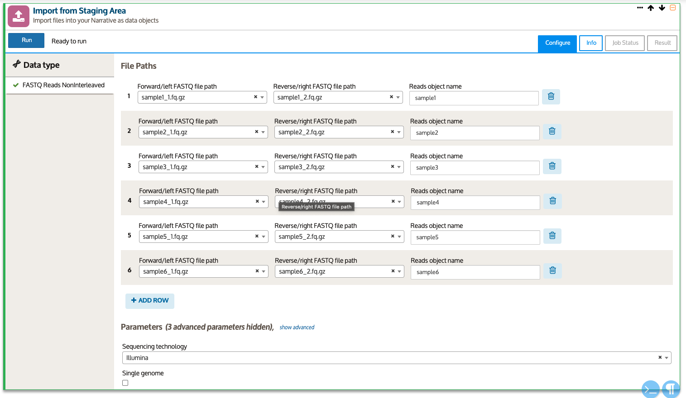
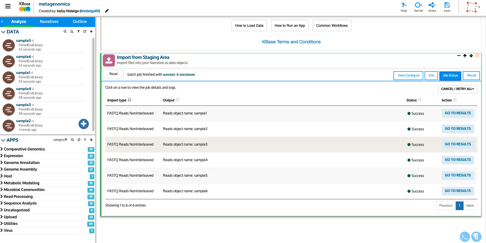
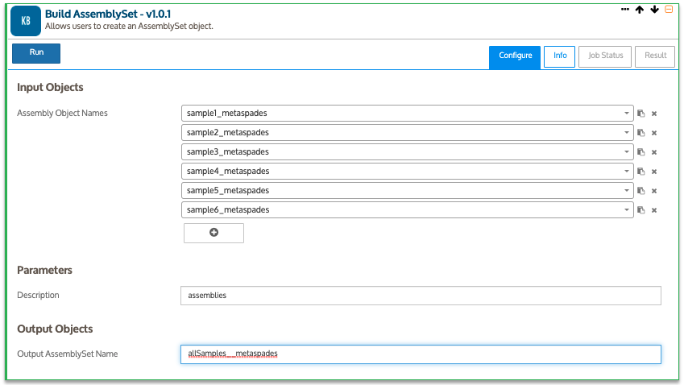

<!-- README.md is generated from README.Rmd. Please edit that file -->
<!-- badges: start -->

<!-- badges: end -->

# Metagenómica usando KBASE 

**Autor: MsC. Kelly Hidalgo**

Tutorial para el análisis de metagenomas obtenidos a partir de
secuenciación masiva usando la plataforma Illumina. El procesamiento
bioinformático será realizado usando la plataforma online [**KBASE**]().
El *dataset* ejemplo usado para este tutorial, es un conjunto de seis
sub-muestras con 200 mil secuencias cortas paired-end de 150 bp.

------------------------------------------------------------------------

# WORKFLOW

## 0. Acceso a KBASE

### 0.1. Creando una cuenta en KBase

Ingrese al link para crear una conta:
[singup!](https://narrative.kbase.us/#signup)

[En este link](https://docs.kbase.us/getting-started/narrative) puede
visitar el extenso manual/tutorial de la plataforma.

Para facilitar accese desde una cuenta de Google

En KBase, usted puede crear flujos de trabajo que pueden ser compartidos
y reproducidos, llamados **Narrativas**, que incluyen datos, etapas de
análisis, resultados, visualizaciones y comentarios.

### 0.2. Criando una Narrativa

El primer paso es crear una nueva narrativa, clicando en *+ New
Narrative*. Una vez creada, cambie el nombre de la narrativa para
metagenomica, clicando en el título en la esquina superior izquiera
*Untitled*.

### 0.3. Adquisición de datos

Los datos usados para este tutorial pueden ser descargados mediante el
siguiente
[link](https://drive.google.com/drive/folders/1Vpecu6sQ598UPAFrhB0B8moEhTHK8MJG?usp=sharing).

Será descargado en su computador una carpeta compactada llamada
*metagenomica\_con\_kbase*. Descompacte, para tener acceso a las
archivos de las muestras. Encontrará 12 archivos que corresponden a 6
muestras (\_1 y \_2) paired-end, nombradas como `sample1_1.fq.gz` hasta
`sample6_2.fq.gz`.

### 0.4. Upload de datos

En la sección **DATA** de KBase, será abierta una pestaña para cargar
los datos desde una carpeta de su computador. Selecione los archivos
adquiridos.

Después de subir los archivos en la plataforma, estos deben ser
importardos dentro de la narrativa. Para esto, es necesario seleccionar
el tipo de datos. Para este caso se trata del formato *FASTQ Reads
Noninterleaved*, clique en *Import selected*.

Automaticamente será abierta la primera herramienta a ser usada *Import
from Staging Area*. LLene los campos conforme la foto y clique en *Run*.

La herramienta primero hará la lectura de los archivos y después los
juntará en un objeto único (p.e. *sample1*, *sample2*, etc.) y estarán
disponibles dentro de la narrativa en la pestaña de la izquierda *DATA*.

> Las herramientas que seran usadas pueden ser encontradas en la pestaña
> *APPS* a la izquierda, en la cajita de busqueda.

## 1. Control de calidad

### 1.1. Verificando la calidad

En esta etapa será verificada la calidad de las secuencias usando la
herramienta
[FastQC](https://www.bioinformatics.babraham.ac.uk/projects/fastqc/).
Busque en el catálogo de herramientas de KBase y clique en el nombre.
Inmediatamente será insertada en la narrativa debajo de la herramienta
de importación.

Seleccione la primera muestra *sample1* en la caja de input (*Read
Library/RNA-seq Sample Set*)

A veces los análisis en KBase pueden demorar un poco más de lo normal de
un servidor local, debido a que se trata de un servidor público usado
por muchas personas al mismo tiempo.

Una vez el análisis sea concluido, tendrá acceso a los resultados en la
pestaña *Results*. En la sección *Report* serán disponibilizados los
reportes FastQC. Estos pueden ser descargados en la sección *Files*,
teniendo un reporte para cada read (\_1 y \_2).

> **Este proceso debe ser repetido para cada muestra**

### 1.2. Depuración y filtración de secuencias

la remoción de secuencias y bases de baja calidad debe ser realizada en
base a los reportes de verificaciónde la calidad. El programa
[Trimmomatic](http://www.usadellab.org/cms/?page=trimmomatic), mediante
diversos argumentos realiza el filtrado y la depuración de las
secuencias.

Antes de usar Trimmomatic y con el objetivo de facilitar el proceso,
será usada una herramienta que creará un objeto único con todas las
muestras. De esta forma, usted podrá ejecutar el proceso con todas las
muestras al mismo tiempo. Procure en la caja de busqueda de
herramientas: *Build ReadsSet*.

En *Reads Libraries* adicione cada una de las muestras y adicione una
descripción y un nombre para el objeto de salida conforme en la imagen

Al terminar el proceso, tendrá un objeto llamado *AllSamples*, en donde
se encuentran todas las muestras.

A continuación busque Trimmomatic en el catálogo y adiciónelo en la
narrativa. En el input, selecione *AllSamples*. Clique en *show
advanced* para modificar los argumentos de corte e filtrado. Baseado en
los resultados de los reportes de FastQC, use los siguientes parametros:

El análisis habrá terminado cuando se muestre la palabra *Sucess*.
Explore los resultados clicando en la pestaña *Results*.

En la sección *Report*, usted podrá observar graficamente el número de
secuencias que pasaron en cada muestra los filtros usados.

Como resultado del proceso, Trimmomatic creará varios nuevos objetos:

-   *readsClean\_trim\_paired*: Reads limpias pareadas, tipo de objeto
    *ReadsSet*
-   *readsClean\_trimm\_paired\_SampleSet*: Reads limpias pareadas, tipo
    de objeto *RNASeqSampleSet*
-   *readsClean\_trimm\_unpaired\_fwd*: Reads limpias no pareadas
    forward, tipo de objeto *ReadsSet*
-   *readsClean\_trimm\_unpaired\_fwd\_SampleSet*: Reads limpias no
    pareadas forward, tipo de objeto *RNASeqSampleSet*
-   *readsClean\_trimm\_unpaired\_rev*: Reads limpias no pareadas
    reverse, tipo de objeto *ReadsSet*
-   *readsClean\_trimm\_unpaired\_rev\_SampleSet*: Reads limpias no
    pareadas reverse, tipo de objeto *RNASeqSampleSet*

Al mismo tiempo, en la sección *DATA*, además de los objetos descritos
anteriormente que corresponden a las muestras agrupadas, el programa
también disponibilizó las muestras limpias pareadas y no pareadas
individualmente.

Despues de la filtración y depuración de secuencias, es recomendable
repetir el análisis con Fastqc para verificar la calidad de las
secuencias filtradas pareadas (*readsClean\_trimm\_paired\_SampleSet*).

> FastQC acepta objetos de tipo *RNASeqSampleSet*, por tanto ahora es
> posible ejecutar el análisis para todas las muestras filtradas al
> mismo tiempo.

## 2. Ensamblaje

### 2.1. Spades

El esamblaje es el proceso de alineamiento de secuencias curtas con el
objetivo de recuperar una secuencia mayor. En el caso del ensamblaje *de
novo* son usados algorítmos baseados en *k-mers*, que son subsecuencias
con tamaño

definido por el usuario (p.e. 21-mers).

Busque el ensamblador [MetaSpades](https://github.com/ablab/spades) en
el catálogo y adicionelo en la narrativa.

Ejecute el montaje para la primera muestra. Clique en *show advance*
para modificar los parametros da ensamblaje:

Al ejecutar MetaSpades, una vez terminado el ensamblaje, sera
automaticamente ejecutado el programa
[MetaQuast](http://quast.sourceforge.net/) para analizar la calidad.
Usted puede tener acceso al reporte de salida de MetaQuast en la pestaña
*Results*.

Descargue el reporte en la sección *Links*, clicando en el link *QUAST
report* donde podrá explorar todas las métricas de calidad.

Fíjese que el montaje (*sample1\_metaspades*) debe aparecer en la
pestaña *DATA*.

### 2.2. MegaHit

Con el objetivo de comparar diferentes montajes y escoger la mejor con
base en las métricas de calidad de ensambles, use el montador
[MegaHit](https://github.com/voutcn/megahit), el cual también usa el
mismo algorítmo (Grafo de De Bruijn) para el montaje de secuencias
cortas.

Al igual que MetaSpades, en Megahit después de terminado el montaje, el
programa de evaluación de la calidad, MetaQuast es ajecutado
automaticamente.

Para comparar más facilmente los dos montajes, busque el programa
*Compare Assembled Contig Distributions*.

Explore los gráficos y resultados obtenidos de la comparación de los
montajes:

El mejor montaje será el que tenga menor número de contigs, mayor número
de contigs grandes, y N50 mayor.

Normalmente con el programa MetaSpades se obtienen mejores resultados,
termine el procesamiento del resto de las muestras con este montador.

## 3. Anotación de genes

### 3.1. Taxonómica

La anotación taxonómica en KBase puede ser ejecutada usando el programa
[Kaiju](https://kaiju.binf.ku.dk/), que usa la base de datos RefSeq del
genbank. Dentro de KBase solo es posible hacer la asignación taxonómica
en los reads y no en el montaje.

Busque Kaiju en el catálogo de herramientas de KBase y coloque las
informaciones según la imagen.

Una vez terminado el proceso de anotación, en la pestaña resultados,
encontrará un completo reporte con varios gráficos de barras en los
diferentes níveles taxonómicos.

Así como también gráficos interactivos de tipo Krona:

Adicionalmente, en la sección *Files*, se encuentran varios archivos de
salida que pueden ser descargados.

### 3.1. Funcional

KBase ofrece varias opciones para anotación funcional, entre ellas se
encuentra, [Prokka](https://github.com/tseemann/prokka),
[MG-RAST](https://www.mg-rast.org) y
[DRAM](https://github.com/WrightonLabCSU/DRAM). En este tutorial serán
abordadas las anotaciones con Prokka y DRAM. Todas estas herramientas,
antes de realizar la asignación funcional, hacen la predicción de los
genes. Basicamente se trata de buscar codones de inicio y de parada para
determinar donde empiezan y terminan los genes a ser anotados. El
progama más usado para este fin se llama
[Prodigal](https://github.com/hyattpd/prodigal/wiki).

#### 3.1.1 Prokka

El proceso de anotación debe ser realizado ensamble por ensamble
(muestra por muestra), pues esta herramienta no permite como input un
conjunto de ensambles.

Cuando terminado el proceso, será creado el objeto de salida que
contiene las anotaciones. Para tener acceso a este objeto, en la sección
*Objects*, haga click en el nombre del objeto. Se abrirá una nueva
ventana en la narrativa, que contiene una tabla interactiva, con tres
pestañas: *Overview* con las estadísticas de la anotación, como número
de genes encontrados, número de tRNAs, etc.

*Browse Features* donde podrá explorar todas las anotaciones, también es
posible filtrar por palabras claves las anotaciones de interés (p.e.
nombre del gen).

*Browse Contigs*, donde podrá acceder a cada uno de los contigs y ver la
localización de los genes encontrados y anotados.

> Repita el proceso de anotación funcional para cada uno de los
> montajes.

#### 3.1.2 DRAM

La anotación con DRAM puede ser realizada a un conjunto de ensambles,
por lo tanto primero debe ser creado este conjunto usando la herramienta
*Build AssemblySet*.

Una vez creado el conjunto de ensambles, busque DRAM en el catálogo de
programas de KBASE y adicionélo en la narrativa.

En la pestaña *Results*, encontrará un gráfico con la anotación de KEGG,
que representa que tan completas están cada una de los módulos. También
encontrará un gráfico de ausencia/presencia de genes relacionados al
metabolismo de carbohidratos, metabolismo del nitrogeno y del sulfuro,
etc.

–

# Bonus

## 4. Recuperación de Genomas

La recuperación de genomas a partir de metagenomas, consiste en la
clusterización de los contigs/scaffolds obtenidos en el ensamblaje,
baseados en diferentes caracteristicas, tales como: i) contenido de GC,
ii) frecuencia de tetrámeros, iii) cobertura, iv) perfil filogenético,
asumiendo que por tener estas caracteristicas similares, pertenecen al
mismo genoma.

Existen varias herramientas que permiten hacer este proceso. Lo
recomendado es usarlas todas para recuperar el mayor número de genomas
posibles.

### 4.1. Co-assembly

Con el fin de mejorar la recuperación de genomas, en algunas ocasiones
es recomendado hacer un co-assembly con todas las muestras, para generar
un solo conjunto de contigs/scaffolds.

Para realizar este proceso en KBase, primero es necesario juntar todas
las muestras, mediante el proceso de merge. Use la herramienta *Merge
Reads Libraries* para tal fin.

Use metaSPAdes para generar el coassembly con el elemento creado en el
comando anterior. Usa una lista de *k-mers* de 21, 39, 59, 79, 99 y 119
y tamaño minimo de contig de 500 bp.

### 4.2. Binning

Todos los programas de binning calculan la información de cobertura de
las secuencias en el ensamble, pues es una de las caracteristicas de los
contigs que es usada para clusterizarlos.

En KBase, actualmente están disponibles tres herramientas de binning,
[Metabat2](https://bitbucket.org/berkeleylab/metabat/src/master/),
[CONCOCT](https://github.com/BinPro/CONCOCT) y
[MaxBin2](https://denbi-metagenomics-workshop.readthedocs.io/en/latest/binning/maxbin.html).

#### 4.2.1 MetaBat2

Busque Metabat2 en el catálogo para agregarlo en la narrativa. Use el
co-assembly y las secuencias limpas pareadas para el proceso.

Los resultados serán presentados una vez terminado el proceso.
Encontrará el número de contigs que fueron clusterizados y número de
bins generados. También se abre otra ventana en la narrativa con más
informaciones sobre los resultados.

#### 4.2.2. MaxBin2

Repita el proceso con el programa MaxBin

Al igual que con el programa anterior, los resultados presentan el
número de contigs clusterizados y número de bins y adicionalmente en
otra ventana son presentadas más informaciones.

#### 4.2.3. CONCOCT

Por último use la herramienta CONCOCT

### 4.3 De-replicación

Este proceso compara los bins generados por todas los programas y
elimina los repetidos, escogiendo los mejores.

Los resultados:

### 4.4. Control de calidad

Una vez se tiene el conjunto de bins recuperados a partir del
co-assembly, es necesario verificar la calidad de cada uno, medida en
completeza y contaminación. La completeza se refiere a el porcentaje de
genes de copia única y la contaminación se da cuando estos genes
aparecen más de una vez.

El progama usado para este objetivo se llama
[CheckM](https://github.com/Ecogenomics/CheckM)

Los resultados mostrarán graficamente y en forma de tabla los datos de
completeza y contaminación de cada bin.

### 4.5. Anotación taxonómica

La anotación taxonómica sera ejecutada usando el programa
[GTDB-tk](https://ecogenomics.github.io/GTDBTk/index.html).

Los resultados serán presentados en una tabla con la afiliación
taxonómica más próxima y algunos score de ese proceso.

### 4.6. Anotación funcional

Al igual que los ensambles, los genomas recuperados pueden ser anotados
funcionalmente con Prokka.
